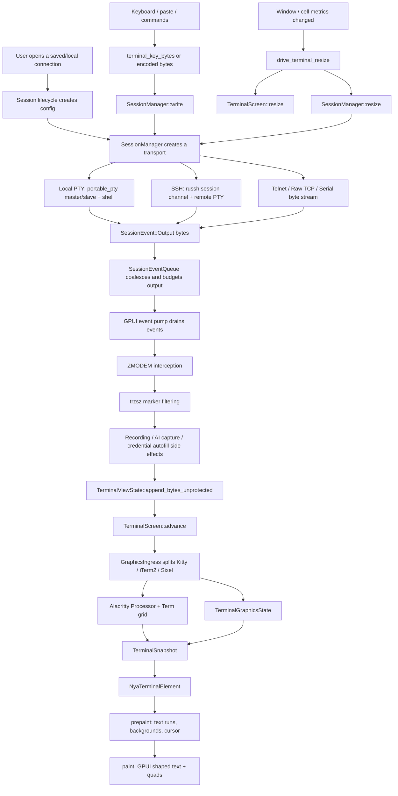

# NyaTerm Terminal Pipeline

See `docs/terminal-pipeline-audit.md` for the live requirement/evidence audit
used to track completion of the terminal-link goal.

## Core Shape

NyaTerm's terminal path is intentionally split into three layers:

```text
connection/session layer -> terminal model -> GPUI rendering
```

The connection layer only produces and consumes bytes. It does not render text.
The terminal model parses terminal bytes into an Alacritty-backed grid. The GPUI
layer renders snapshots of that grid.

This mirrors the useful part of the OxideTerm design: SSH, local PTY, Telnet,
Raw TCP, and Serial all converge into one terminal model instead of each
connection type owning a separate renderer.

## End-To-End Flow



## Entry Points

The application creates and owns a shared `SessionManager` in
`crates/nyaterm-desktop/src/features/app_state/construct.rs`.

Session startup is coordinated by:

- `crates/nyaterm-desktop/src/features/session/session_lifecycle.rs`
- `crates/nyaterm-desktop/src/features/session/session_runtime/background.rs`
- `crates/nyaterm-transport/src/lib.rs`

`SessionManager` exposes one service shape for all interactive session kinds:

```rust
pub enum SessionEvent {
    Output { session_id: String, data: Vec<u8> },
    OutputDropped { session_id: String, bytes: usize },
    Exited { session_id: String },
    Error { session_id: String, message: String },
}
```

The desktop layer never needs to know whether the bytes came from a local PTY,
an SSH channel, Telnet negotiation, Raw TCP, or a serial port.

## Local PTY vs SSH PTY

There are two different meanings of "PTY" in the code path:

- Local terminal: NyaTerm creates a real operating-system PTY with
  `portable_pty`, spawns the shell on the slave side, and reads from the master.
  UI-created local PTYs use the current terminal surface geometry for both
  `cols`/`rows` and pixel dimensions when those metrics are available.
- SSH terminal: NyaTerm opens a `russh` session channel, requests a PTY from the
  remote server with `request_pty`, then starts the remote shell with
  `request_shell`. There is no local PTY file descriptor for the remote shell.

Both paths emit `SessionEvent::Output` bytes and accept `write`/`resize` calls
through `TerminalTransport`.

## SSH Channel Path

SSH interactive sessions are created by
`SessionManager::create_ssh_session` or
`SessionManager::create_ssh_session_with_multiplex`.

The worker path is:

```text
create_ssh_session_inner
  -> run_ssh_worker
  -> open_ssh_shell
  -> open_authenticated_ssh_handle...
  -> channel_open_session
  -> request_pty(config.term, cols, rows)
  -> request_shell
```

Once the shell is open, `run_ssh_worker` selects over two directions:

```text
command_rx -> SshCommand::Write / Resize / Close -> russh channel
russh channel -> ChannelMsg::Data / ExtendedData -> SessionEvent::Output
```

Resize becomes `channel.window_change(cols, rows, pixel_width, pixel_height)`.

## Output Budgeting

`SessionEventQueue` is the first protection point between transport threads and
the GPUI event pump.

It coalesces consecutive output events from the same session and enforces:

- per-output-event cap: `SESSION_EVENT_QUEUE_OUTPUT_EVENT_LIMIT`
- total queued output cap: `SESSION_EVENT_QUEUE_OUTPUT_LIMIT`
- drain-time output budget via `drain_events_with_output_budget`

Dropped bytes are reported as `SessionEvent::OutputDropped` so the UI can show
an explicit overloaded status instead of silently losing data. Desktop also
writes a plain local marker into the affected session buffer and recording, so
copy/AI/recording consumers see where the byte stream became discontinuous.
Handling `OutputDropped` resets the affected view's terminal parser, graphics
ingress, visible output decoder, recording decoder, and pre-parser ZMODEM
detector before later retained bytes are parsed. If a ZMODEM transfer is active,
the transfer is failed and the remote side receives a cancel sequence because
the protocol byte stream is no longer contiguous. If an AI agent observation is
waiting on capture markers for that same session, the step is failed
immediately with an explicit discontinuity observation instead of letting the
capture processor keep buffering a marker sequence that may never complete.

The GPUI event pump runs in
`crates/nyaterm-desktop/src/features/shell/event_pump.rs`. It drains a bounded
batch each tick, then calls the terminal view append path.

The second protection point is per-view visible backlog trimming. If one output
chunk is larger than the visible backlog cap, nyaterm keeps the newest tail but
first resets the terminal parser, graphics ingress, and visible output decoder
for that view. The retained tail is therefore parsed as a fresh stream instead
of being glued to a skipped UTF-8/GBK/ANSI/OSC/Kitty fragment. Recording has
already consumed the full event-pump chunk on this path, so its decoder is not
rewound for visible-only tail trimming.

## Protocol Interception

Terminal bytes are intercepted before they reach the terminal parser when a
non-display protocol needs to consume them.

Graphics protocols are intercepted inside `TerminalScreen::advance` via
`GraphicsIngress` (before Alacritty's ANSI processor):

```text
SessionEvent::Output
  -> process_zmodem_output (desktop)
  -> process_trzsz_output (desktop marker filtering)
  -> TerminalScreen::advance
       -> GraphicsIngress (Kitty / iTerm2 / Sixel)
       -> terminal segments -> ANSI Processor + Term grid
       -> graphics events -> TerminalGraphicsState
  -> TerminalSnapshot.images (+ above_text)
  -> GPUI under-text / above-text image layers
```

Today the active transfer interception point is ZMODEM:

```text
SessionEvent::Output
  -> process_zmodem_output
  -> visible terminal bytes, or transfer protocol handling
```

This is the same architectural slot where other side-band terminal protocols
should live. `nyaterm-transport` includes a stream-safe trzsz trigger detector,
and the desktop event pump consumes those marker bytes on output that remains
after active ZMODEM payloads are removed, but before terminal parsing. It
preserves the official trigger metadata (`S`/`R`/`D`, version, unique id,
Windows-server marker, tunnel port). After a trigger, desktop keeps a per-session
`TrzszTransferState` and `TrzszProtocolStream` active in the same pre-parser
slot. That stream filters transfer-stage `#TYPE:<payload>` lines before
recording/terminal parsing, observes `#ACT`, `#CFG`, `#NUM`, `#SIZE`, `#DATA`,
`#SUCC`, `#fail`, `#EXIT`, and consumes the binary body following
`#DATA:<len>` headers. It decodes zlib+base64 string payloads, parses integer
headers such as binary `#DATA:<len>` and numeric `#SUCC:<len>` acknowledgements,
and exposes typed `TrzszAction` / `TrzszConfig` values for action/config
negotiation. The transport crate can also build official `#TYPE:<payload>`
frames for local `ACT`, local `CFG`, integer acknowledgements, string
acknowledgements, and failure replies. `TrzszTransferState` maps
trigger/protocol frames into transfer phases/events (`Started`, `Action`,
`Config`, metadata, data, success, failure, exit). `TrzszDownloadEngine` is the
first real consumer-side protocol core for remote `tsz` downloads: it consumes
`NUM`, `NAME`, `SIZE`, binary or encoded `DATA`, and `MD5`, emits file-count,
file-name, size, chunk, finished, and completed events, validates chunk lengths
and MD5, and generates the matching `SUCC` acknowledgements. Desktop now wires
that remote `tsz` download path into the configured local download directory,
creates transfer jobs for progress/completion, sanitizes file names, avoids
overwriting existing files, and writes protocol responses through the
unrecorded protocol-response path. Directory downloads (`tsz -d`) parse official
`sourceFile` JSON names, create nested local directories, keep each `path_id`
under one unique local top-level name, and still filter all protocol bytes out
of terminal paint. `TrzszUploadEngine` is the matching upload-side protocol
core for local file uploads to a remote `trz`: it sends `NUM`, waits for
`SUCC`, sends `NAME`, waits for the remote accepted name, then gates
`SIZE`/`DATA`/`MD5` on the matching acknowledgements and validates mismatched
acks. Desktop now wires regular-file remote `trz` uploads by prompting for
local files, sending local `ACT`, feeding remote `SUCC` acknowledgements through
the upload engine, writing generated protocol frames through the unrecorded
protocol-response path, and reporting `TrzszUpload` transfer jobs. Directory
upload triggers (`trz -d`) prompt for local directories, recursively build
official `sourceFile` JSON `NAME` entries, send directory entries as NAME-only
items, and send regular files beneath them through the same upload engine. The detector also follows the
official stale-trigger guard for text that already contains transfer/status
fragments such as `#CFG:`, `Saved`,
or `Cancelled`, so old protocol text is not reinterpreted as a fresh transfer.
It also keeps the official repeated unique-id guard, so a long transfer id that
has already triggered once is passed through
as terminal text instead of producing a second unsupported response. The rule
is:

```text
Only bytes that should be visible terminal content should enter TerminalScreen.
```

## Session Encoding

After `GraphicsIngress` splits graphics events, remaining terminal bytes are
decoded to UTF-8 for Alacritty using the session charset. Outgoing paste and
typed text are re-encoded to that charset before `SessionManager::write`.
The same `TerminalOutputDecoder` path is used for per-session views and the
legacy/global fallback buffer, so split multibyte output and stripped graphics
payloads do not fall back to lossy UTF-8 text.

```text
raw session bytes
  -> GraphicsIngress (raw)
  -> terminal segments -> SessionEncoding::decode (UTF-8/GBK/…)
  -> ANSI Processor + Term grid

host input (UTF-8)
  -> SessionEncoding::encode_outgoing
  -> SessionManager::write
```

The interaction setting `default_encoding` (`UTF-8` / `GBK`, …) is applied to
each `TerminalScreen` when the session view is created and when the setting
changes. A resolved encoding change resets the streaming text decoder and raw
graphics ingress state; incomplete multi-byte characters or graphics control
sequences are not carried across the settings boundary. Graphics payloads never
pass through charset conversion.

Text input recording keeps the logical UTF-8/ASCII input bytes, while the PTY
write receives the charset-encoded wire bytes. Raw binary sends use the separate
raw recorded boundary when the exact byte stream matters. That boundary stores
the transcript entry as `RAW_INPUT` with space-separated lowercase hex bytes, so
non-UTF-8/control bytes remain recoverable instead of being lossy-decoded or
stripped as text.
Plain text input recording skips terminal protocol input sequences such as
`ESC [` CSI, SS3, OSC, and DCS. Arrow keys, focus/mouse reports, and other
terminal control traffic still go to the PTY, but they do not leak fragments
like `[A` or mouse coordinates into the next recorded `INPUT` command line.
Terminal-generated protocol responses (DSR/OSC/Kitty replies, focus reports)
use a raw unrecorded write path: they go back to the PTY, but are not labeled as
user input in recordings or command history.

Session output recording uses the same raw graphics split + session charset
decode semantics through a separate `TerminalOutputDecoder` per session view.
That keeps recordings aligned with the text the terminal model sees without
advancing the `TerminalScreen` decoder state twice.

Per-session terminal buffer text uses its own `TerminalOutputDecoder` as well.
The decoder exposes a streaming text boundary, so split UTF-8/GBK/etc.
multi-byte characters are held until complete instead of being lossy-decoded per
event chunk. Copy-buffer actions, AI context, and AI agent observation therefore
read the same decoded text boundary instead of a global UTF-8-lossy byte log.
AI agent command capture may hide marker lines and captured command output from
the visible terminal, but any remaining visible text is encoded back to the
session charset and appended through the byte path so ANSI/OSC/parser semantics
stay inside `TerminalScreen::advance`. Capture filtering is keyed to the
terminal session that launched the observed command, so switching the active
pane does not let capture markers leak into that session's terminal grid or
recording before the agent loop notices the focus change. Follow-up agent
continuation requests reuse the same launching session id, recent output, and
launch metadata instead of sampling whichever pane is currently active.
Prompt consumers such as credential autofill are fed from this decoded terminal
text path too, so localized prompts follow the active session charset.

When a session view is rebuilt from seed output during reconnect/startup restore,
the saved text is replayed as already-decoded terminal text and the resulting
view immediately receives the current interaction encoding. That keeps early
post-restore input encoding and later output/recording decoders aligned even
before the remote sends another byte.

Local status/log text generated by nyaterm is already decoded UTF-8. It enters
the grid through `TerminalCore::advance_decoded_text` and is appended directly to
the decoded buffer, so GBK or other non-UTF-8 session settings do not corrupt
localized UI messages. Remote session bytes still use the raw `advance` path.
Queue-drop markers and session error logs are recorded when they are appended to
the visible session buffer, keeping recordings aligned with nyaterm-generated
terminal text the user actually saw. Error text that comes from a backend error
string is escaped before it enters the terminal model, so control characters are
shown as plain text instead of being executed as ANSI/OSC protocol. The common
local-log append path also preserves log framing (`CR` / `LF` / `TAB`) while
escaping `ESC` and other control characters, so connection names, paths, and
other external strings cannot inject terminal protocol into nyaterm-generated
status lines.

## Terminal Model

`crates/nyaterm-terminal` owns the terminal model.

The central type is:

```rust
pub struct TerminalCore {
    parser: ansi::Processor,
    term: Term<NyaTermEventProxy>,
    ...
}

pub type TerminalScreen = TerminalCore;
```

`TerminalScreen::advance(bytes)` sends bytes through:

```text
NyaTermSidecar
  -> shell/window-title/cwd side effects
Alacritty ansi::Processor
  -> alacritty_terminal::Term grid
NyaTermEventProxy drain
  -> TerminalEffects
```

`TerminalEffects::pty_write` is written back through the unrecorded protocol
response boundary (`SessionManager::write`, without `RecordingManager::write_input`
or command-history tracking). This carries terminal-emulator responses such as
device attributes and device status reports back to the active shell instead of
leaving them inside the UI model, without presenting them as user keystrokes in
recordings.

Alacritty is used as a terminal core, not as a renderer. It tracks screen state,
scrollback, cursor, colors, styles, OSC 8 hyperlinks, wide characters, and
terminal modes.

## Snapshot Boundary

The GPUI layer does not render `alacritty_terminal::Term` directly. It asks the
terminal model for a `TerminalSnapshot`.

Important fields include:

```rust
pub struct TerminalSnapshot {
    pub cols: usize,
    pub rows: usize,
    pub cells: Vec<RenderCell>,
    pub cursor: CursorSnapshot,
    pub lines: Vec<String>,
    pub styled_lines: Vec<Vec<StyledSpan>>,
    pub hyperlink_lines: Vec<Vec<HyperlinkSpan>>,
    pub line_timestamps_ms: Vec<Option<u64>>,
    pub images: Vec<GraphicsImageSnapshot>,
    pub command_marks: Vec<Option<ShellCommandMark>>,
    pub scrollback_len: usize,
    pub total_rows: usize,
    pub display_offset: usize,
}
```

`snapshot_from_term` converts Alacritty cells into `RenderCell` and compressed
styled spans. It handles wide-character spacers, zero-width combining
characters, colors, style flags, cursor state, scrollback offset, and OSC 8
hyperlinks.
GPUI decoration mapping keeps zero-width combining marks attached to the
preceding terminal cell and counts Unicode wide characters as two cells, so
search, selection, action-link, and cursor column ranges stay aligned with the
terminal grid. The GPUI background pass uses the same terminal-cell count, so
cell and keyword background rectangles do not grow an extra column for
combining marks or shrink behind wide glyphs.
Search and action-link byte ranges are converted through the same terminal-cell
helpers before painting or hit-testing, so underline, search wash, and pointer
activation all target the same painted columns.

Line timestamps are maintained in the terminal model by tracking per-line
signatures. Changed visible lines and lines newly scrolled into history receive
wall-clock unix millisecond stamps, which flow through
`TerminalSnapshot::line_timestamps_ms` into the existing GPUI gutter.

OSC 133 shell integration (`A`/`B` prompt, `C` output start, `D` finished) is
tracked as absolute Alacritty line marks. After each parser advance, fired marks
are stamped on the cursor line and retained/shifted with other line metadata.
Viewport rows expose them as `TerminalSnapshot::command_marks`, which the
desktop canvas maps into `TerminalLineDecorations::command_mark` for GPUI.

`TerminalViewState` stores the per-session screen, raw text mirror, scroll
offset, unread flag, render cache, and large-output protection state.

The configured scrollback limit is applied to Alacritty's grid with
`Term::set_options`, so changing NyaTerm's scrollback setting updates the actual
retained terminal history instead of only clamping what the UI can view.

## GPUI Rendering

`crates/nyaterm-terminal-gpui` owns terminal rendering and input helpers.

The primary render element is `NyaTerminalElement`:

```text
TerminalSnapshot
  -> terminal_highlight_spans
  -> prepaint text runs / backgrounds / cursor
  -> GPUI paint quads + shaped text
```

`terminal_canvas_for` in
`crates/nyaterm-desktop/src/features/terminal/terminal_surface/canvas.rs`
selects the active session snapshot, maps search and selection ranges into the
viewport, adds action-link, OSC 8 hyperlink, and OSC 133 command-mark
decorations, then creates `NyaTerminalElement`.

`NyaTerminalElement` has the usual GPUI element phases:

```text
request_layout -> prepaint -> paint
```

In `prepaint`, it builds layered paint state:

- cell / keyword background quads
- under-text graphics (Kitty `z<=0`, iTerm2, Sixel) and placeholders
- search / selection decoration washes
- active-search gutter marks and OSC 133 command-mark bars
- shaped text lines with GPUI `TextRun`s
- above-text graphics (Kitty `z>0`) and placeholders
- a cursor quad when the live viewport is active

Text shaping is delegated to GPUI's text system through `shape_line` and
`TextRun`s. NyaTerm does not currently own a separate terminal-specific bidi
reordering layer; any bidirectional script handling comes from GPUI/cosmic-text
shaping rather than an explicit `TerminalElement` bidi pass. If terminal-specific
bidi controls are added later, they should be modeled as snapshot/render inputs
and included in the row layout cache key.

Command-mark colors (left 2px bar, same layer as active-search):

- `Prompt` (`A`/`B`) → theme `accent`
- `Output` (`C`) → theme `text_muted`
- `Finished` (`D` / `D;0`) → theme `success`
- `Finished` (`D;code` with `code != 0`) → theme `danger`

When both an active-search mark and a command mark exist on the same row, the
command bar is offset 1 cell-edge (2px) so both remain visible.

`paint` emits those layers in OxideTerm-aligned order so protocol images sit
between cell backgrounds and selection/search, and glyphs stay above selection:

```text
cell/keyword bg
  -> under-text images
  -> search + selection washes
  -> active marks (search + OSC 133)
  -> text runs
  -> above-text images
  -> cursor
```

The scrollbar is owned by the desktop terminal surface rather than
`NyaTerminalElement` itself. `terminal_scrollbar_element` reads the active
session scroll offset / scrollback length and maps track drags back into the
per-session `TerminalViewState.scroll_offset`.

## Input And Resize Path

Keyboard events are encoded in `crates/nyaterm-terminal-gpui/src/input.rs`.

The basic path is:

```text
GPUI KeyDownEvent
  -> terminal_key_bytes
  -> send_terminal_input_with_options
  -> write_session_input_recorded (active + sync peers)
  -> SessionManager::write + RecordingManager::write_input
  -> record_command_history_for_sessions (once for all successful targets)
  -> active transport
```

Synchronized input peers share the same recorded write and command-history path
as the active session, so multi-session typing stays consistent in recordings
and per-session history. Global command history is still appended once per
submission. Fan-out status text is formatted through
`terminal_input_fanout_status`, which keeps the active-session, successful-peer,
and partial-failure messages consistent across typed input, key protocol events,
and paste.

The recording layer treats terminal protocol input as side-band control traffic.
It keeps a per-session pending escape state while parsing logical input, so
split CSI/SS3/OSC/DCS chunks are skipped across `write_input` calls instead of
leaking protocol bytes into command text recordings.

Mouse tracking follows the same sync-group fan-out, but stays out of command
history. Press events are encoded per target session, and the set of peers that
accepted the press is retained so drag and release reports keep going to the
same remote applications even if focus or sync-group state changes before
mouse-up.

Paste and command sending use the same session write boundary after applying
their own UI-level confirmation or formatting behavior. Bracketed paste framing
is decided per target session, so synchronized peers with different DECBPM
state receive correct `ESC [200~` / `ESC [201~` wrapping independently.
Multi-line paste confirmation modes delegate status to that boundary too, so
write failures and synchronized-peer partial failures are not masked by the
overlay action.

Quick-command actions use the same success signal: they only replace the
lower-level send status with "ran/inserted quick command" after the primary
write and every synchronized peer write succeeds.

Startup commands, local file-drop insertion, and bottom-panel command sending
also preserve the session write result. Text session writes return success only
after `SessionManager::write`, recording, and per-session history have accepted
the bytes; higher-level UI actions only publish success text after that
boundary succeeds, and repeated sends report failed write counts.
Action-link commands, Docker command helpers, and transfer-browser path
insertion follow the same rule so disconnected or failed writes are not masked
by feature-level success text.
Bottom-panel Hex sends use the raw recorded boundary so arbitrary binary bytes
are written and recorded exactly, are not passed through the text charset
encoder, and are not interpreted as command history. The recording line is
hex-formatted `RAW_INPUT`, not a lossy text decoding of those bytes.

Readiness probe commands use the same recorded input boundary, but target only
the active session and are intentionally left out of command history.
The ZMODEM upload bootstrap command (`rz\r`) is recorded the same way; once the
ZMODEM protocol starts, transfer frames are written through the unrecorded
protocol-response path so binary payload bytes are not recorded as typed input
and are not charset-transcoded.

When `interaction_mac_ime_compatibility` is enabled, the terminal output area
registers a GPUI `ElementInputHandler` during paint. Plain printable key events
are allowed to propagate to that handler, while control/special keys still use
`terminal_key_bytes`. IME preedit text stays in desktop state until commit and
is painted as a cursor-anchored overlay on the active terminal surface, so the
terminal grid, output recording, and command history are not mutated by
composition updates. The committed text is written through the same
`send_terminal_input` boundary as normal typing, including suggestion tracking
when appropriate. Non-smart buffer selection still uses the isolated
no-suggestion path, matching ordinary keydown behavior. If the painted selection
maps to the tracked smart input line, IME commit first uses the same
smart-selection replacement path as paste and normal printable key input.
Smart-input click and replacement mapping use terminal-cell segmentation too,
keeping zero-width combining marks attached to the preceding input cell so byte
ranges stay aligned with painted columns.
Terminal selection copy and double-click word expansion use the same cell
segmentation, so copied text and word bounds match the painted selection columns
instead of splitting a combining sequence into a separate selectable column.
Terminal hit-testing also uses terminal-cell counts for visible grid bounds and
cell-to-byte conversion, including mapping the spacer half of a wide character
back to its base glyph, keeping action-link activation aligned with the text
that was actually underlined.

Keyboard encoding consults DECCKM application-cursor mode from the active
screen: plain arrows/home/end become `SS3` (`ESC O …`) when enabled. Modified
arrows still use CSI with a modifier parameter. Plain Backspace is DEL
(`0x7f`); Ctrl+Backspace is BS (`0x08`); Alt+Backspace is `ESC DEL` for
delete-word-backward. Kitty keyboard protocol is enabled on the terminal core;
when the remote enables disambiguate mode (`CSI = 1 u` / stack variants),
Ctrl/Alt text keys and ambiguous keys such as Escape/Enter/Tab/Backspace are
encoded as CSI-u. Kitty event-type mode appends press/repeat/release state, and
report-all mode sends printable keys as CSI-u instead of raw UTF-8. Alternate-key
mode adds shifted/base-layout key fields when GPUI exposes enough key metadata,
and associated-text mode appends generated text codepoints from `key_char` when
report-all mode is active. On the
alternate screen, when alternate-scroll is enabled and mouse tracking is off,
the wheel sends Up/Down cursor sequences instead of scrolling local history.
Synchronized peers receive those alternate-scroll cursor inputs only when their
own terminal state is also in that same alternate-scroll slot, so normal
scrollback panes are not turned into keyboard input by another pane's wheel
event.

Mouse reports use SGR (1006) button numbers on both press and release (`M`/`m`),
while legacy X10-style releases still report button code 3. Drag/motion bits and
Shift/Alt/Ctrl modifiers follow the xterm encoding. Button-event mode (1002)
captures the pressed button and sends drag reports through mouse-up, including
sync-input peers that accepted the original press. Any-motion mode (1003) is
handled from root mouse-move events even when no button is pressed: the pane
under the pointer receives a no-button motion report, and sync peers receive the
same report only if their own terminal state has motion reporting enabled.

Cursor paint consumes `TerminalSnapshot.cursor` from the model: remote
`DECSCUSR` shapes (`block` / `underline` / `beam`) and `DECTCEM` visibility are
honored, and blinking follows either the host setting or remote DECSET 12 /
DECSCUSR blink. When the model reports a block cursor, the user settings style
still applies as the default paint form. Application keypad mode (`DECKPAM`)
is exposed on the terminal model and mapped to SS3 keypad sequences on input.

Resize is driven from window and terminal cell metrics:

```text
drive_terminal_resize
  -> TerminalScreen::resize(cols, rows)
  -> SessionManager::resize_with_pixels(session_id, cols, rows, px_w, px_h)
  -> local PTY resize / SSH window_change / request_pty / Telnet NAWS / serial no-op
```

Pixel size comes from the painted terminal content bounds after subtracting host
padding and the timestamp/line-number gutter, while `cols`/`rows` still come
from that same usable area divided by host cell metrics. Local PTY masters and
SSH `request_pty` / `window-change` receive those values so remote apps that
query pixel geometry (and host TUI libraries that use them) get non-zero
dimensions instead of always-zero placeholders. Local PTY creation also receives
those pixel dimensions when a desktop surface has already been measured; tests
or headless callers can leave them at `0` to mean "unknown". When the grid hits NyaTerm's
minimum or maximum cols/rows clamps, pixel dimensions follow the clamped grid
span instead of reporting an impossible sub-cell or over-wide cell ratio.
Per-session views remember the last backend resize tuple, so a font/cell-metric
change still sends a backend resize when `cols`/`rows` stay the same but
`pixel_width`/`pixel_height` changed.
When the workspace is split into multiple terminal panes, each pane records its
own painted terminal bounds and resizes its `TerminalScreen` plus backend PTY to
that pane's grid instead of inheriting the active pane's dimensions. The same
per-pane bounds/grid are used for hit-testing terminal cells, so first-click
selection, wheel mouse reports, and context-menu mouse reports target the pane
under the pointer instead of the previously active pane. Remote mouse capture is
also tied to the session that received the press, so later drag/release reports
continue to that session even if focus changes before mouse-up.

## Current Differences From OxideTerm Reference

NyaTerm follows the same broad layered architecture, but the current
implementation is simpler in several places:

- SSH sessions create their own worker runtime/thread, while multiplex handles
  maintain a shared authenticated SSH runtime for operations that opt into it.
- Interactive SSH sessions enable deferred remote PTY creation. NyaTerm first
  authenticates and registers the session, then opens the remote shell after the
  first resize command or a short fallback using the best known `cols`/`rows`.
  Background SSH starts seed those initial dimensions from the target pane when
  there is one, such as a duplicate/reconnect source pane, and only fall back to
  the active pane or global terminal surface when no target bounds are known.
  Immediately before `request_pty`, the deferred worker drains already queued
  writes/resizes/closes so the PTY opens with the newest available dimensions,
  pending input is preserved, and a tab closed during the defer window
  disconnects the authenticated SSH handle without creating a remote shell.
- Graphics protocol ingress is active in `nyaterm-terminal`: Kitty APC
  (`ESC _ G`), iTerm2 OSC 1337 `inline=1` files / `ClearScrollback`, and Sixel DCS are stripped before
  the ANSI parser and exposed as `TerminalSnapshot.images`; non-Sixel DCS and
  non-`1337` OSC controls are passed through to the ANSI parser unchanged.
  iTerm2 `File=` without `inline=1` is still stripped from the grid but does not
  create an image placement. iTerm2 `ClearScrollback` maps onto Alacritty's
  saved-lines clear path (`CSI 3 J`) without resetting the live screen.
  Incomplete graphics sequences are retained across output chunks, capped at
  8MiB; oversized incomplete payloads are passed through as terminal bytes
  instead of growing pending memory without bound. Kitty multi-chunk transfers
  also cap in-flight payloads at 8MiB and fail the transfer instead of placing a
  partial image. `TerminalSnapshot.images` keeps both the viewport-clipped cell
  rectangle and the full image cell size/source offset, so GPUI clips protocol
  images to the terminal viewport without rescaling partially visible payloads.
  Kitty stored image data is
  capped separately (64 stored images / 16MiB total, 4MiB per payload), pruning
  old unplaced images before images still referenced by live placements; for
  transmit+place, pruning happens after placement insertion and placement-cap
  eviction so the newest reusable payload is not pruned before it becomes live. Kitty actions are
  split: `a=t` store-only, `a=T` transmit+place, `a=p` place from store; multi-
  chunk transfers (`m=1`…`m=0`) reassemble before store/place. Kitty `z>0`
  sets `above_text` so GPUI paints those images above the glyph layer (still
  under the cursor). Kitty delete (`a=d`) supports `d=a/i/n/c/p/x/y/z` (uppercase frees stored image data); placement id `p` is retained for place/delete targeting. Kitty `C=1` moves the text cursor past the placed image (CUD + CHA applied through the ANSI parser). Kitty transmit payloads honor `f=` (24/32/100), optional `o=z` zlib, and `s`/`v` pixel size so raw RGB/RGBA become NYAR rasters and PNG stays PNG for GPUI decode. Kitty `a=q` queries and `q=` quiet modes emit `ESC_G …;OK/ENOENT ST` replies through `TerminalEffects.pty_write` (same path as CSI replies); when `p` is present, the query checks placement existence rather than only stored image data. Image sizes use host cell metrics when raster dimensions
  are known. GPUI decodes PNG/JPEG/GIF/BMP payloads into `RenderImage`
  through `ImageReader` limits plus a 4MiB RGBA raster budget, so small
  compressed inputs cannot expand into oversized render images. Decoded images
  are cached by placement id plus full payload fingerprint with an LRU cap so
  active placements survive cache churn;
  Sixel DCS payloads are rasterized in `nyaterm-terminal` to an intermediate
  NYAR (RGBA) container so GPUI can paint them like other images, with raster
  bytes and repeat counts capped before allocation/expansion. Existing image
  placements are shifted immediately after each terminal-parser feed that grows
  history; this keeps images placed later in the same output chunk on the live
  screen instead of incorrectly moving them into scrollback. Payloads that still
  cannot be decoded fall back to accent placeholders.
- Session charset conversion sits between graphics split and the ANSI grid: output is decoded to UTF-8, input is re-encoded for the wire (GBK and friends via `encoding_rs`). Graphics payloads stay on raw bytes.
- OSC 133 shell-integration marks (`A`/`B`/`C`/`D`) are stored per absolute line
  and painted as a left gutter bar in `NyaTerminalElement`. `D;code` carries an
  optional exit status used to color success (`0`/missing) vs danger (non-zero).
- ZMODEM remains the transfer-oriented pre-parser interception point in the
  desktop event pump (before bytes enter `TerminalScreen::advance`).
- trzsz has a transport-level trigger detector for the official
  `::TRZSZ:TRANSFER:` marker plus a desktop event-pump filtering hook that keeps
  markers out of terminal paint. Remote `tsz` file and directory downloads now
  have a desktop consumer that writes to the configured download directory and
  reports transfer jobs. Regular-file remote `trz` uploads now prompt for local
  files, send local protocol frames through the unrecorded response path, and
  report `TrzszUpload` transfer jobs. Directory upload (`trz -d`) prompts for
  local directories, sends official `sourceFile` JSON names, and reports
  directory/file entries as `TrzszUpload` jobs.
  The detector includes stale-marker and repeated unique-id guards to avoid
  re-triggering old protocol text.
- The event pump cadence is 50ms for the wider window runtime, with explicit
  output budgets and queue coalescing to keep the UI responsive.

## Maintenance Rules

When adding a new connection type, keep it behind `TerminalTransport` and emit
`SessionEvent::Output` bytes.

When adding a protocol that should not be printed, intercept it before
`TerminalScreen::advance`.

When adding terminal-rendered state, prefer extending `TerminalSnapshot` instead
of letting GPUI reach into `alacritty_terminal::Term`.

When adding input behavior, encode it as bytes before crossing into
`SessionManager::write`, so all transports keep one write path.

OSC 52 clipboard requests are exposed through `TerminalEffects` and applied in
the desktop output path: store writes the host clipboard, load formats a reply
and sends it back through the unrecorded protocol response path. Both directions cap
host clipboard text before accepting or replying to remote OSC 52 traffic. If a
load request reaches this boundary without a UI context, nyaterm returns an
empty OSC 52 reply instead of silently dropping the protocol response.

`ColorRequest` and `TextAreaSizeRequest` are answered inside `TerminalCore` as
`pty_write` responses (using host cell metrics for pixel size). Terminal font
family/size/weight changes invalidate those metrics, immediately push fallback
cell sizes into all terminal screens and resize every known pane/backend from
its stored surface bounds; the render tick then replaces the fallback with
measured GPUI text-system metrics and resizes the same surfaces again if the
pixel dimensions changed. DECSET 1004 focus reporting is tracked on the
terminal model; the desktop focus path sends
`CSI I` / `CSI O` to the active session when the terminal surface gains or
loses focus, and active-session switches hand off focus from the old session to
the new one while the terminal surface remains focused. Focus and mouse reports
both go to the PTY; focus reports use the unrecorded protocol response path,
while mouse reports remain user interaction input. Neither path updates command
history.
